# Csh-Winforms
## I. Thành phần trong Winfroms
### 1. label
- ``Label`` thường được dùng hiển thị thông tin chỉ đọc và thường sử dụng kèm với các điều khiển khác để mô tả chức năng.

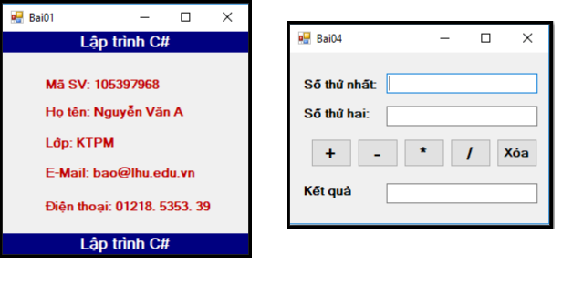

- Thuộc tính thường dùng

|Thuộc tính	| Mô tả|
|:----------|:------|
|BorderStyle|Thiết lập đường viền|
|Font	|Thiết lập font chữ hiển thị trên Label|
|Text	|Nội dung hiển thị trên Label|
|Backcolor	|Màu nền của Label|
|ForeColor|	Thiết lập màu chữ hiển thị trên Label|
|Name|	Tên của Label|
|TextAlign|	Canh lề nội dung của Label (Left/Center/Right)|
|Visible|	Ẩn hoặc hiện Label|
### 2. button
- ``Button`` là điều khiển tạo giao diện nút lệnh trên Form, khi người dùng nhấn chuột vào nút lệnh thì chương trình sẽ thực hiện một hành động nào đó. Button được đặt trong nhóm Common Controls của cửa sổ Toolbox.

- Thuộc tính thường dùng

|Thuộc tính|Mô tả|
|:---------|:--------|
|Name|Đặt tên cho nút lệnh|
|Text|Nội dung hiển thị lên nút nhấn|
|Visible|Ẩn, hiện nút nhấn|
|Enable|Cho phép/ không cho phép tương tác với nút lệnh|
|Font|Chỉ đinh kiểu chữ, kích cỡ chữ hiển thị|
|Image|Hình ảnh hiển thị trên nút lệnh|
|ForeColor|Màu chữ hiển thị trên nút lệnh|
|BackColor|Màu của nút lệnh|
|TabIndex|Chỉ định thứ tự tab của các Button trên Form|

- sự kiện thường dung: Button_Click

### 3. Text box
- ``Textbox`` 

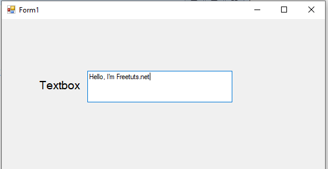
- Thuộc tính

|Thuộc tính|Diễn giải|
|:---------|:--------|
|PasswordChar|Ký tự thay thế khi nhập vào TextBox|
|Multiline|Cho phép Textbox có nhiều dòng hay không|
|ScrollBars|Thanh cuộn (None / Horizontal / Vertical / Both)|
|MaxLength|Quy định chuỗi Max sẽ nhập vào Textbox, mặc định là 32767|
|Focus|Textbox sẵn sàng được tương tác bởi người dùng|

- Một số sự kiện thường dùng của Textbox:

|Sự kiện|Diễn giải|
|:------|:--------|
|KeyDown|Thực hiện công việc nào đó khi một phím được nhấn xuống|
|KeyUp|Thực hiện công việc nào đó khi một phím được thả ra|
|KeyPress|Xảy ra khi người dùng nhấn một phím và thả ra. Mỗi sự kiện| |KeyPress|cho ta một cặp sự kiện KeyDown và KeyUp|
|TextChanged|Giá trị của thuộc tính Text bị thay đổi|
|MouseEnter|Chuột nằm trong vùng thấy được của Textbox|
|MouseHover|Chuột nằm trong vùng hiển thị một quảng thời gian|
|MouseLeave|Chuột ra khỏi vùng nhập liệu của Textbox|
|MouseMove|Chuột được di chuyển trên Textbox|

- Một số phương thức của Textbox:

|Phương thức|Mô tả|
|:----------|:----|
|Clear()|Xóa tất cả chuỗi hiển thị trong Textbox|
|Cut()|Di chuyển phần nội dung bôi đen của chuỗi|
|Paste()|Dán phần nội dung được chọn của chuỗi|
|Copy()|Sao chép phần nội dung được bôi đen của chuỗi|
|Undo()|Khôi phục thao tác trước|
|Select()|Chọn một phần nội dung của chuỗi trong Textbox|
|SelectAll()|Chọn tất cả nội dung của chuỗi trong Textbox|
|DeselectAll()|Bỏ chọn chuỗi trong Textbox|
### 4. Check box
Checkbox là điều khiển cho phép người dùng chọn hoặc không chọn trên Form, người dùng có thể chọn một hoặc nhiều giá trị cùng lúc.

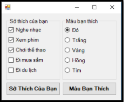

|Thuộc tính|Mô tả|
|:---------|:----|
|Checked	|Giá trị True là được chịn, nếu thiết lập False thì không được chọn|
|CheckState|Thường dùng để kiểm tra tình trạng Checkbox có được chọn hay không. Mang 3 giá trị UnChecked, Checked và Indeterminate|
|AutoCheck|	Mang giá trị True hoặc False, nếu giá trị True thì cho phép người dùng nhấp chuột để chọn, nếu là False thì không cho phép người dùng nhấp chuột chọn|
|Text|	Chuỗi văn bản hiển thị bên cạnh Checkbox
|ThreeState|	Mang giá trị True hoặc False; nếu là True thì cho phép Checkbox có 3 trạng thái: Checked, UnChecked, Indeterminate|
|RightToLeft|	Mang giá trị Yes hoặc No; cho biết chuỗi văn bản hiển thị (thuộc tính Text) nằm bên trái hay bên phải của Checkbox|
- sự kiện : CheckedChanged
### 5. Radio Button
- ``RadioButton`` tương tự như Checkbox là điều khiển cho phép người dùng chọn hoặc không chọn, điểm khác biệt là với RadioButton người dùng chỉ có thể chọn một giá trị trong một nhóm. 

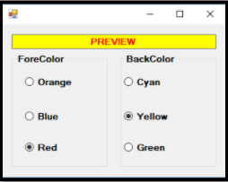

- sử kiện : CheckedChanged
### 6. Panel and FlowlayoutPanel
### 7. Message box
- ``MessageBox`` trong C# là một điều khiển được sử dụng để hiển thị các thông báo hoặc hộp thoại tương tác cho người dùng trong ứng dụng Windows Forms. Nó là một cách đơn giản để giao tiếp với người dùng thông qua các thông báo hoặc câu hỏi xác nhận, và có thể chứa các nút lựa chọn, các biểu tượng khác nhau để thể hiện trạng thái hoặc loại thông báo.

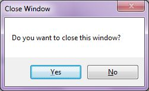
``` C#
MessageBox.Show("Message","Title", button, icon);
```
### 8. Combobox
- Thuộc tính quan trọng

|Thuộc tính|Mô tả|
|:---------|:----|
|Items| Thuộc tính này mô tả tất cả các mục trong ComboBox Thuộc tính này chủ có thể đọc|
|Datasource| Nguồn dữ liệu được đưa vào |
|SelectedIndex| Chỉ số của mục được chọn trong ComboBox|
|SelectedItem| Mục mà người dùng chọn|
|SelectedValue| Chọn danh sách các đối tượng và muốn lấy giá trị của một thuộc tính trong đối tượng||
|Text| Nội dung mà người dùng nhập vào ComboBox |
|DropDownStyle| Kiểu của ComboBox: DropDown, DropDownList, hoặc Simple|
|DropDownHeight/DropDownWidth DropDownStyle| Điều chỉnh chiều cao và chiều rộng của phần danh sách khi người dùng mở ComboBox|
|AutoCompleteMode & AutoCompleteSource| tự động phát hiện điền  vào chỗ chống từ nguồn đã chọn|
formatstring
sort 
maxitems

- Phương thức quan trọng 

|Phương thức|Mô tả|
|:----------|:----|
|Add| Thêm một mục vào ComboBox.|
|Clear| Xóa tất cả các mục trong ComboBox.|
|Remove| Xóa một mục cụ thể.|
|FindString| Tìm kiếm một mục trong ComboBox bằng cách sử dụng chuỗi.|
|GetItemAt| Lấy mục tại vị trí chỉ định.|

- Sự kiện quan trọng: ComboBox_SelectedIndexChanged  ComboBox_SelectedValueChanged


### 10. Picture box
- ``PictureBox`` là một điều khiển (control) trong Windows Forms C# dùng để hiển thị hình ảnh.
- thuộc tính quan trọng

| Thuộc tính | Mô tả |
|:-----------|:------|
|Image|	Ảnh hiển thị trong PictureBox|
|SizeMode|	Cách ảnh được hiển thị: Normal, StretchImage, AutoSize, CenterImage, Zoom|
|BorderStyle|	Kiểu đường viền: None, FixedSingle, Fixed3D|
|BackColor|	Màu nền của PictureBox|
|Backgroudimagelayout| ảnh dưới backgroud|
|errorimage| hiển thị icon khi ảnh lỗi|

- khi muốn đọc ảnh phải đưa ảnh vào project

- tạo Picturebox bằng code
``` C#
PictureBox pictureBox1 = new PictureBox();
pictureBox1.Location = new Point(10, 20); // vị trí của ảnh
pictureBox1.Size = new Size(200, 200);  // kích thước ảnh
pictureBox1.SizeMode = PictureBoxSizeMode.Normal; // mode hiển thị ảnh

pictureBox1.Image = Image.FromFile("C:\\Users\\Laptop\\Pictures\\Picture1.png");
/* sử dụng bitmap 
Bitmap bitmap = new Bitmap("C:\\Users\\Laptop\\Pictures\\Picture1.png");
pictureBox1.Image = bitmap;
*/

Controls.Add(pictureBox1)
```

### 11. List views
ListView là một điều khiển giao diện trong Windows Forms C# dùng để hiển thị danh sách các mục (items),

imagelist

- thuộc tính
items
subitems(items)
view
columns
smallimagelist
largeimagelist
stateimagelist
fullrowselect
stateimagelist + checkbox

### 12. Tree views
Node
showrootline
showplusminus
pathseperator
labeledit
itemheight
iden
### 13. Menu strip

### 14. Tool tip

### 15. Status bar
### 16. Context menu
### 17. Serial Port
### 18. Notify Icon
### 19. Thread 
### 20. Timer
### 21. Processbar
### 22. Numericup down
### 23. Process
### 24. Date time picker
### 25. LinQ
### 26. Entry frame work

## II. Quá trình triển khai một App
#### 1. tải extension
- chọn Extension => Manage Extenstion. Tìm Microsoft Visual Studio Installer Porject 2022
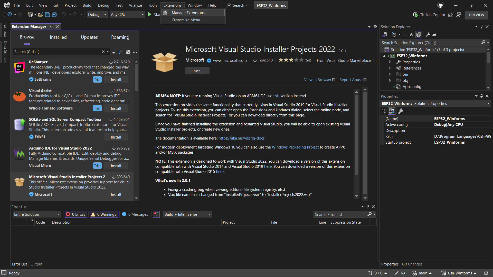
#### 2. Tạo project
- Chuột phải vào solution => add => New project
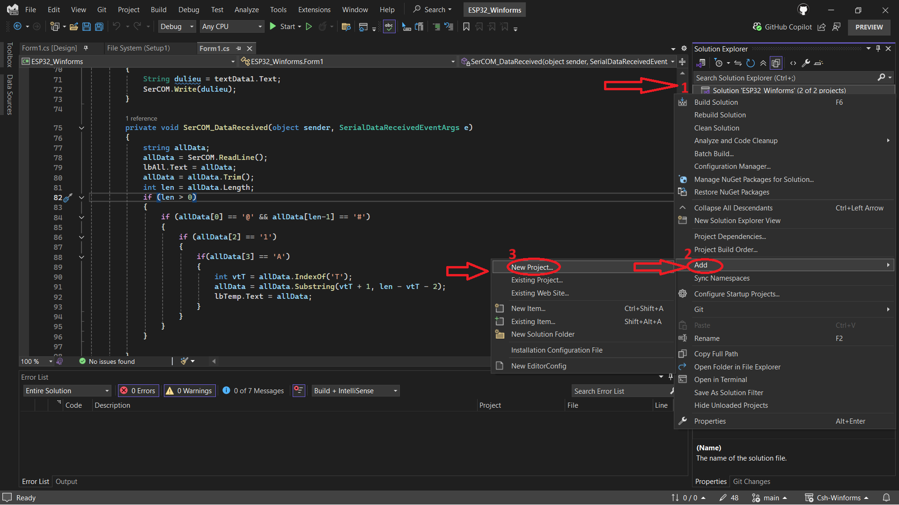
- Chọn Setup Project
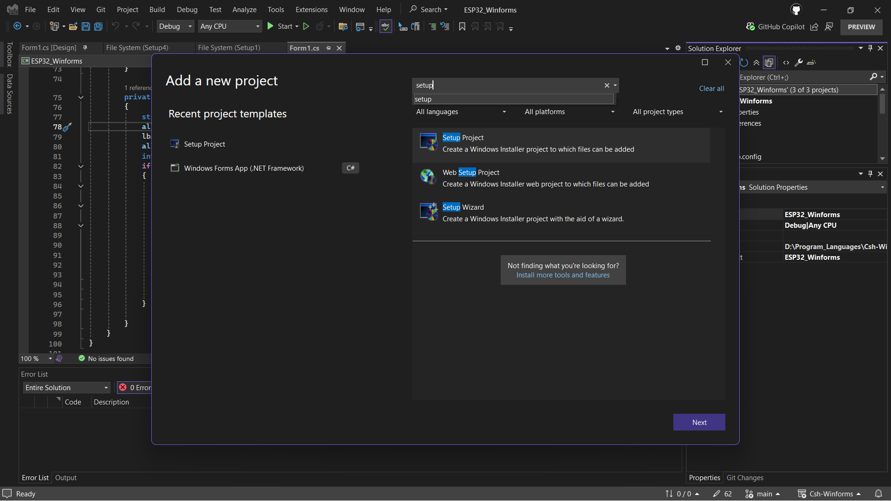
- Chỉnh sửa thông số: tên Project, đường dẫn chứa project  
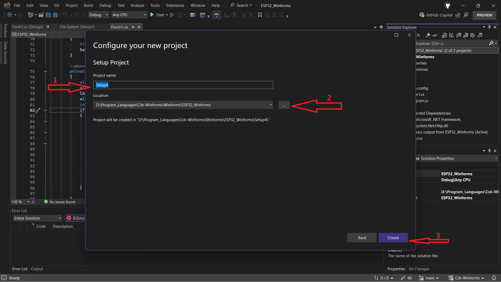
#### 3. thêm project output
- Chọn vào Application Folder
- Chuột phải vào chọn add => Project Output 
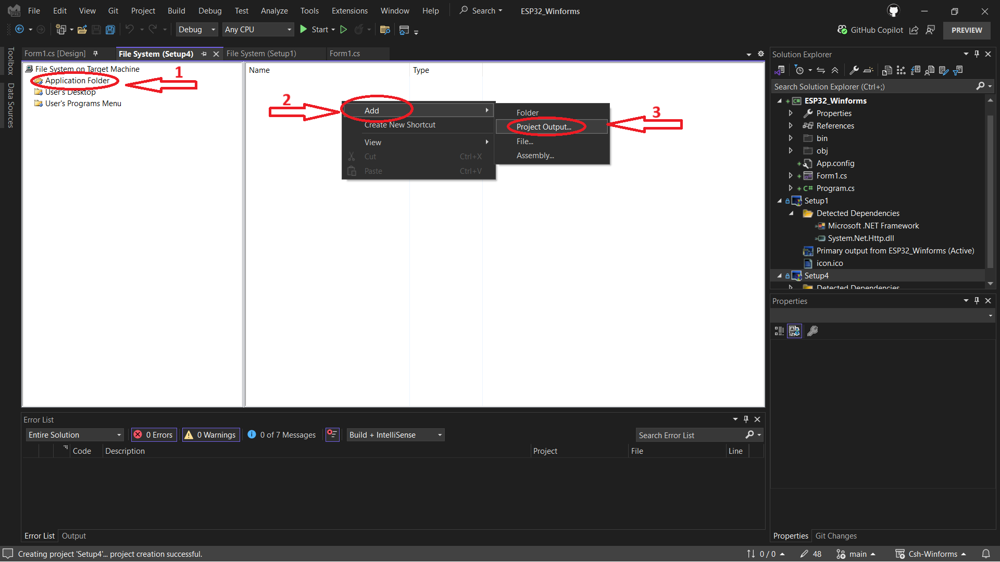
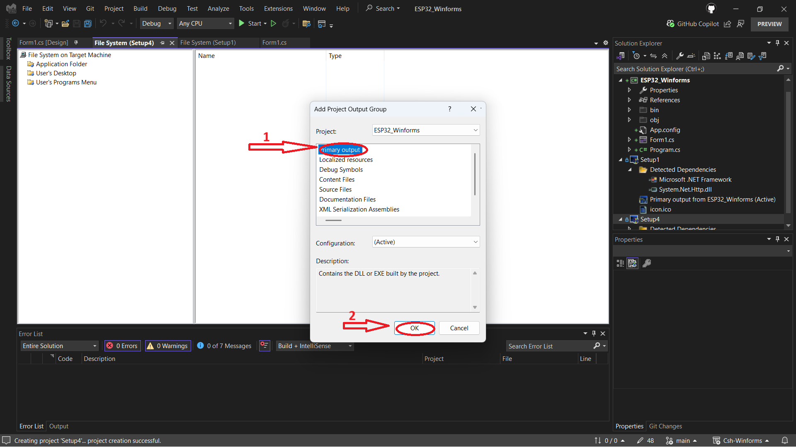
#### 4. tạo file shortcut 
- tạo 2 file shortcut => đưa 2 file đó vào User's Desktop, User's Programs Menu
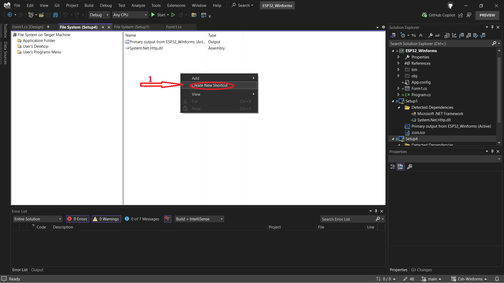
#### 5. Thêm file icon 
- trong Application Folder, chuột phải chọn add => file
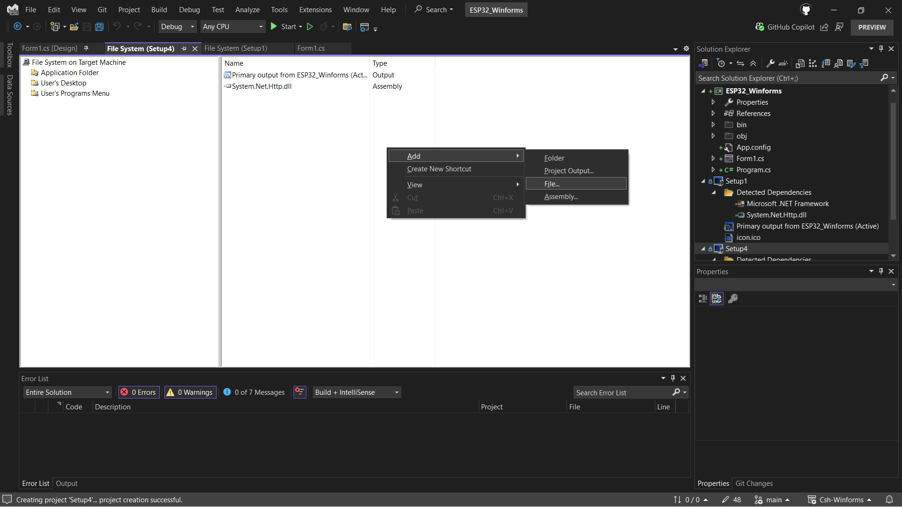
#### 6. Thêm icon cho Destop và program menu
- thêm đường dẫn icon cho user's Destop và User's Program Menu
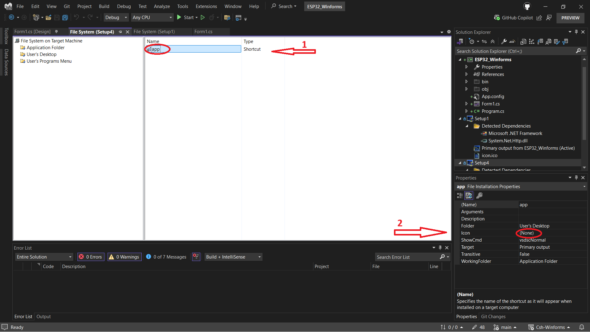
- tìm file icon đã thêm vào Application folder
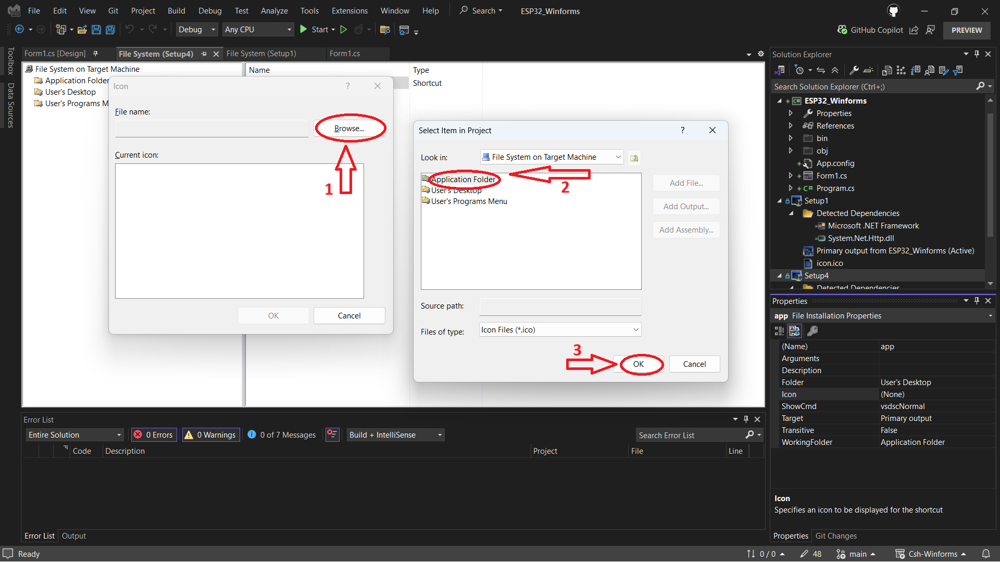
#### 7. Build project
- chính sửa thông số trong property
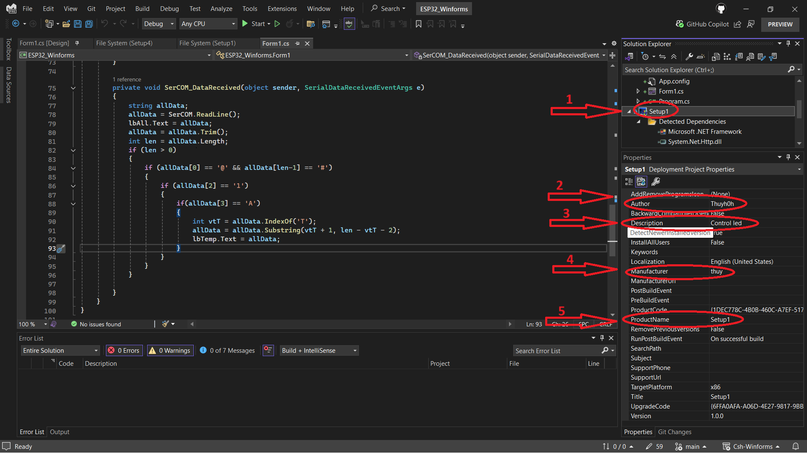
- chuột phải vào file project setup đã tạo => chọn build
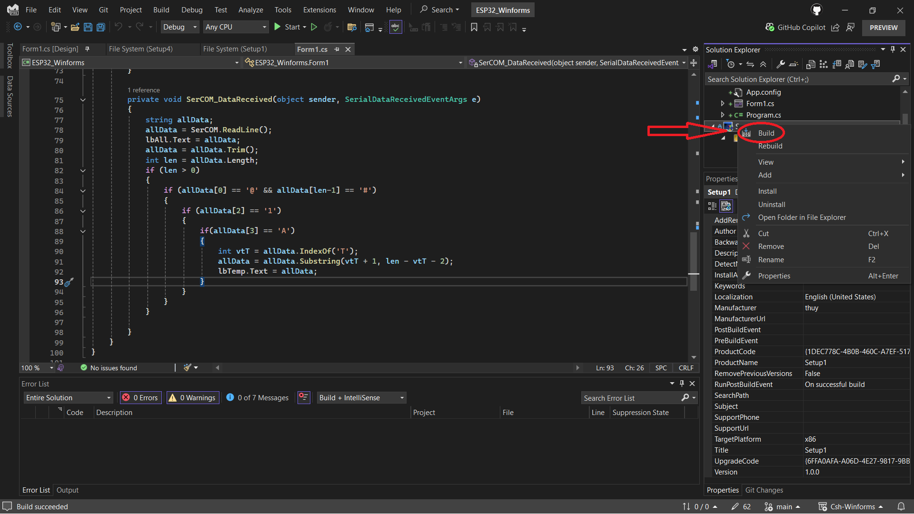
#### 8. Tải chương trình trong máy tính
- vào folder project setup đã tạo => debug => chạy product

## III. Documents
- [Kteam](https://www.youtube.com/playlist?list=PL33lvabfss1y2T7yK--YZJHCsU7LZVzBS)